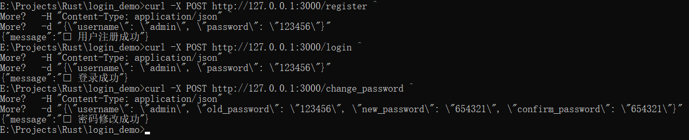

# Axum + sqlx登录示例（SQLite + 明文存储）

一个基于 **Rust + Axum + SQLx + SQLite** 的最简登录系统示例。  
密码为**明文存储**，切勿用于生产环境。

---

## 功能

- 用户注册  
- 用户登录  
- 修改密码  

---

## 依赖

cargo.toml:
[dependencies]
axum = "0.8.6"
hyper = { version = "1.8.0", features = ["full"] }
tokio = { version = "1", features = ["full"] }
serde = { version = "1.0", features = ["derive"] }
serde_json = "1.0"
sqlx = { version = "0.8.6", features = ["sqlite", "runtime-tokio-native-tls", "macros"] }
uuid = { version = "1", features = ["v4"] }
anyhow = "1.0"

▶️ 运行
cargo run
成功启动后会显示：
服务已启动: http://127.0.0.1:3000

如果访问浏览器：http://127.0.0.1:3000
返回：
json：
{"message": "Axum + sqlx 登录示例"}

📡 API 说明
1️⃣ 注册
POST /register

json：
{"username": "alice", "password": "123456"}

2️⃣ 登录
POST /login

json：
{"username": "alice", "password": "123456"}

3️⃣ 修改密码
POST /change_password

json：
{
  "username": "alice",
  "old_password": "123456",
  "new_password": "abcdef",
  "confirm_password": "abcdef"
}

curl 测试:

# 注册
curl -X POST http://127.0.0.1:3000/register ^
  -H "Content-Type: application/json" ^
  -d "{\"username\": \"admin\", \"password\": \"123456\"}"

# 登录
curl -X POST http://127.0.0.1:3000/login ^
  -H "Content-Type: application/json" ^
  -d "{\"username\": \"admin\", \"password\": \"123456\"}"

# 修改密码
curl -X POST http://127.0.0.1:3000/change_password ^
  -H "Content-Type: application/json" ^
  -d "{\"username\": \"admin\", \"old_password\": \"123456\", \"new_password\": \"654321\", \"confirm_password\": \"654321\"}"

# 测试结果示例

数据存储:
数据库文件：users.db（自动生成）

表结构：
sql：
CREATE TABLE users (
    id INTEGER PRIMARY KEY AUTOINCREMENT,
    username TEXT UNIQUE NOT NULL,
    password TEXT NOT NULL
);
